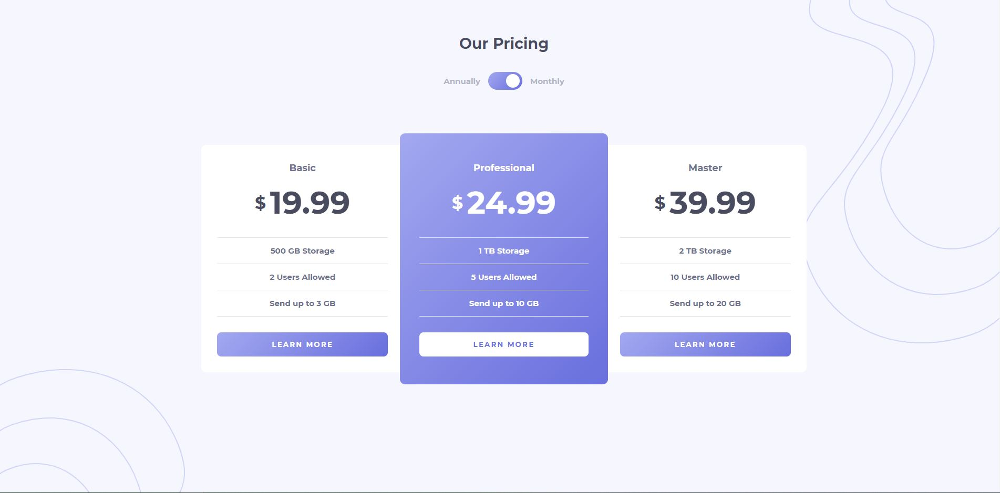

# Frontend Mentor - Pricing component with toggle solution

This is a solution to the [Pricing component with toggle challenge on Frontend Mentor](https://www.frontendmentor.io/challenges/pricing-component-with-toggle-8vPwRMIC). Frontend Mentor challenges help you improve your coding skills by building realistic projects. 

## Table of contents

- [Overview](#overview)
  - [The challenge](#the-challenge)
  - [Screenshot](#screenshot)
  - [Links](#links)
- [My process](#my-process)
  - [Built with](#built-with)
  - [Useful resources](#useful-resources)
- [Author](#author)

## Overview

### The challenge

Users should be able to:

- View the optimal layout for the component depending on their device's screen size
- Control the toggle with both their mouse/trackpad and their keyboard
- **Bonus**: Complete the challenge with just HTML and CSS

### Screenshot

### Links

- [Solution FrontendMentor](https://www.frontendmentor.io/solutions/pricing-component-with-toggle-challenge-C1WHzgG8v)
- [Live Site](https://ezevasari.github.io/pricing-component-challenge/)

## My process

### Built with

- Semantic HTML5 markup
- CSS custom properties
- Flexbox
- Mobile-first workflow
- JavaScript Vanilla

### Useful resources

- [How to create a toggle switch](https://www.w3schools.com/howto/howto_css_switch.asp) - This helped me for create toggle switch.
- [CSS multiple background](https://www.w3schools.com/css/css3_backgrounds.asp)

## Author

- LinkedIn - [LinkedIn](https://www.linkedin.com/in/ernesto-vasari-13b366185/)
- Frontend Mentor - [@ezevasari](https://www.frontendmentor.io/profile/EzeVasari)
- Twitter - [@ezevasari](https://www.twitter.com/ezevasari)
